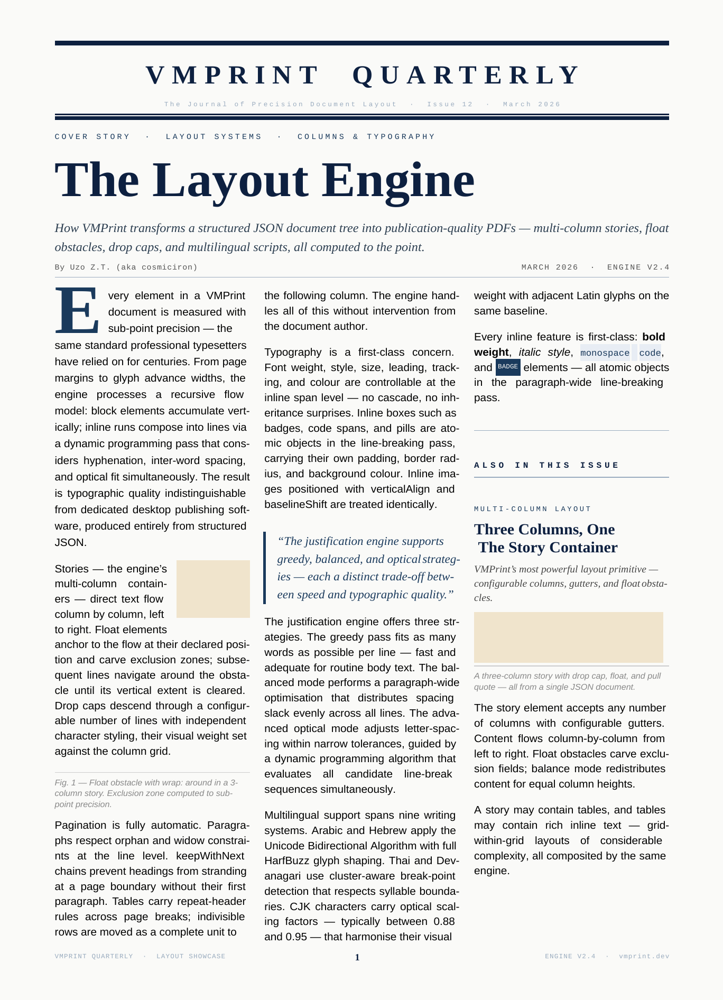
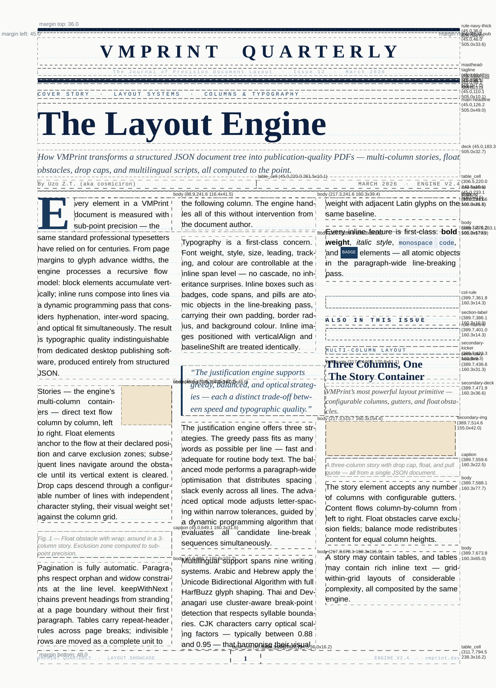
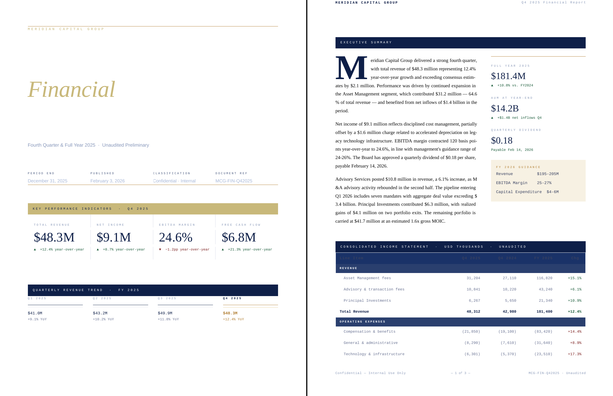

# VMPrint

*I built the layout engine so you don't have to.*

VMPrint is a layout engine. Not a PDF library. Not a renderer. A layout engine — the component that decides where every glyph goes, negotiates page breaks, resolves mutual spatial dependencies between dynamic regions, and produces a flat array of exact X/Y coordinates for every box and text run in the document.

What you do with that output is your call: render to PDF, replay on a Canvas, drive a word processor's display layer, feed it to a WebGL pipeline. The engine's job ends when the math is done.

The architecture is backed by a pending patent. The core insight: document layout is a **deterministic spatiotemporal simulation**, not a pipeline. Document elements are autonomous actors inhabiting a persistent world coordinate space. Pages are viewport projections over that world — they are not containers that content gets assigned into. Actors negotiate geometry with their neighbors, publish committed facts when their placement settles, and other actors observe those facts and respond — all within a single forward simulation pass. The output is captured when the world reaches equilibrium.

That is not a metaphor. It is the literal execution model. It is why things that require multiple passes in every other system — a table of contents that needs accurate page numbers, a dynamic region that depends on sibling geometry — resolve correctly in one pass here.

<p align="center">
  
  
</p>
<p align="center"><em>Left: rendered output. Right: the same document with <code>--debug</code> — every actor boundary and box labeled. The layout is fully inspectable data.</em></p>

---

## Who needs a layout engine

**Canvas and WebGL tool builders.** Teams building Figma-class apps, infinite whiteboards, or data visualization platforms have typically abandoned the DOM and render everything through Canvas, WebGL, or WebGPU. When a user types Arabic text or mixes scripts, a naive word-wrap breaks. VMPrint acts as a typographic microservice: hand it a JSON document with text, fonts, and bounding constraints; get back a flat array of exact glyph X/Y coordinates per line. You draw. VMPrint does the math.

**High-volume report generators.** FinTech, LegalTech, and MedTech platforms generating thousands of complex PDFs per day — financial audits, personalized contracts, localized dossiers. The default approach — spinning up headless Chrome via Puppeteer — requires a full browser process per worker: ~300MB RAM, hundreds of milliseconds of cold-start overhead, subprocess privilege, and cost that scales linearly with concurrency. VMPrint runs inside your existing Node.js process or V8 isolate. 326 pages, warm: **718ms**. No browser. No subprocess.

<p align="center">
  
  
</p>
<p align="center"><em>Left: financial report output. Right: 324-page manuscript, Markdown to PDF, end-to-end in 2.32s.</em></p>

**Print-on-demand and automated publishing.** Photobook generators, catalog compilers, automated textbook and direct-mail systems. CSS `@page` and `break-inside: avoid` are notoriously unreliable across browsers. VMPrint is deterministic: page 42 is page 42 on every machine, every OS, every run. Pagination is a first-class physical constraint resolved by a simulation engine, not a browser heuristic.

**Word processor and document editor builders.** Teams building collaborative editors, screenwriting tools, academic paper editors, or SOP builders. `contenteditable` gives you no programmatic layout state — you cannot ask the DOM where line 3 ends without expensive range measurements. VMPrint gives you the layout as inspectable data: every line break, every page break, mathematically determined, available as a flat JSON structure you can diff, serialize, and replay. More than that — VMPrint knows where every individual glyph is and what it is. Accurate cursor placement, text selection, and hit-testing are not afterthoughts you bolt on; they fall out of the layout data directly. This is not a black box and it is not a one-way street. The [vmprint-preview](https://github.com/cosmiciron/vmprint-preview) package demonstrates glyph-level hit-testing in a browser canvas today.

**Edge runtime and serverless.** Deploying to Cloudflare Workers, Deno Deploy, or Lambda@Edge where headless Chrome is impossible — no subprocess, bundle limits as low as 1MB. VMPrint is pure TypeScript with no native shaping dependencies and no binary requirements. It runs in a V8 isolate.

---

## What it does that prior systems cannot

**Single-pass TOC, index, and bibliography.** A table of contents must know page numbers before it can render, but the page numbers of all subsequent content depend on how much space the TOC occupies. Every prior system resolves this circular dependency through a second layout pass, an approximation, or external auxiliary files (LaTeX's `.aux`, BibTeX's `.bbl`). VMPrint resolves it in one pass: heading actors emit committed signals as their geometry settles; the TOC actor observes those signals within the same running simulation and assembles accurate entries. The numbers are exact. There is no second pass. No auxiliary files.

**Multi-script and bidi layout without an external shaping engine.** No HarfBuzz. No ICU. No system-level binary. Arabic, Hebrew, Thai, Devanagari, CJK, and Latin on the same line — each script segment measured against its own font metrics, bidi-reordered, baseline-aligned against the dominant line metrics — in pure JS. Built-in Noto font families for Arabic, Thai, Devanagari, and CJK are bundled; no registration required.

<p align="center">
  
</p>

**Content-only updates that never trigger spatial resettlement.** When a page counter updates from 11 to 12, every prior layout system responds by recalculating layout, partially or fully. VMPrint classifies actor update outcomes into three tiers: no-change (negligible cost), content-only (in-place redraw, no resettlement), and geometry-changing (targeted dirty-frontier resimulation from the earliest affected point). A counter changing its displayed number pays the in-place redraw cost only. Nothing downstream is touched.

**Deterministic speculative layout with rollback.** Widow/orphan control, keep-with-next rules, and cohesion policies are evaluated by placing a speculative branch, scoring it against the continuity policy, and either committing or rolling back to a bit-for-bit identical kernel snapshot. The rollback is atomic and complete — active actor state, signal bus staging buffers, and world-space coordinates all revert exactly. No heuristic. No approximation.

**Layout output as flat, traceable, serializable data.** The engine produces `Page[] of Box[]` — absolutely positioned primitives with full semantic provenance on every box: which AST node produced it, which fragment, which transformation kind. Diff layout changes as JSON. Pre-compile and cache the layout, render it later. Feed the flat geometry directly to a GPU draw pipeline. This is the format Canvas and WebGL consumers need.

**Documents that program themselves.** VMPrint documents can carry script methods that run as first-class participants in the layout simulation — not as post-processing hooks or injected JavaScript, but as actors wired into the same lifecycle, event bus, and settlement mechanism as the layout engine itself. An `onReady()` handler fires after layout has fully settled and can query real page numbers, real element positions, and real content counts — then mutate the document structure in response. `replace()` swaps a placeholder element for a fully generated table. `append()` adds entries to a live list. Elements can send typed messages to each other, enabling coordination without a central orchestrator. When a script mutates structure, the simulation resettles from the earliest affected point — not from scratch. No prior layout engine has a scripting model that participates in the simulation rather than running after it.

**Patent-pending microkernel architecture.** The engine's behavior — single-pass cyclic dependency resolution, speculative pathfinding with deterministic rollback, branch-aware transactional signal isolation, three-tier update outcome classification, world-map spatial model with viewport-based pagination, and kernel-owned simulation clock — is covered by a pending patent application with photographic evidence of reduction to practice for every novel claim.

---

## Get started

```bash
npm install @vmprint/engine @vmprint/local-fonts @vmprint/context-pdf
```

See [QUICKSTART.md](QUICKSTART.md) to render your first document in a few lines of TypeScript. For the full element and layout reference: [guides/](guides/).

---

## Packages

**This repository**

| Package | Purpose |
|---|---|
| [`@vmprint/engine`](engine/) | Layout engine and primary API |
| [`@vmprint/contracts`](contracts/) | TypeScript interfaces: `FontManager`, `Context`, `OverlayProvider` |
| [`@vmprint/cli`](cli/) | CLI for batch JSON-to-PDF workflows |

**Companion repositories**

| Package / Repository | Purpose |
|---|---|
| [`@vmprint/context-pdf`](https://github.com/cosmiciron/vmprint-contexts) | PDF output context (pdf-lib, browser-compatible) |
| [`@vmprint/local-fonts`](https://github.com/cosmiciron/vmprint-font-managers) | FontManager for Node.js filesystem |
| [vmprint-preview](https://github.com/cosmiciron/vmprint-preview) | Browser-based document preview and PDF/SVG export |
| [vmprint-transmuters](https://github.com/cosmiciron/vmprint-transmuters) | Markdown → VMPrint document compiler |

---

## FAQ

**Just want to preview a document in the browser?**
[vmprint-preview](https://github.com/cosmiciron/vmprint-preview) is VMPrint packaged into a browser canvas with live preview, zoom, and PDF/SVG export. You do not need to write engine code.

**Why not Typst?**
Typst is excellent for authored documents and produces beautiful output. It is a Rust binary. You cannot import it into a Node process, run it in a browser, deploy it to a Cloudflare Worker, or call it as a library from a TypeScript application. If you need a layout engine embedded in a JS/TS runtime, Typst is not available to you.

**Why not Puppeteer / headless Chrome?**
Puppeteer is a browser automation tool. It produces PDFs as a side effect of printing a rendered web page. Each concurrent worker requires a full Chrome instance — approximately 300MB of RAM, hundreds of milliseconds of cold-start overhead, and subprocess-level operating system privilege. For one-off document generation it is adequate. For high-volume production workloads the resource cost is substantial and scales linearly with concurrency. VMPrint runs inside your existing application process.

**Is this react-pdf?**
No. react-pdf is a declarative PDF component renderer that assembles PDF primitives through a React tree. It does not perform typographic layout — line wrapping and text positioning are handled by its underlying renderer, and there is no programmatic layout state available to the caller. VMPrint is a layout engine: it computes where things go, produces that result as inspectable data, and hands it to an output context. The layout computation and the rendering are separate, explicit steps.

**Why not LaTeX?**
LaTeX produces excellent typographic output. It is also a 40-year-old macro language that requires an external binary, three or more compilation passes to resolve cross-references and artifact collectors (TOC, index, bibliography), and `.aux` files that persist between runs. It is not embeddable as a library in a running application. If you are building software that generates documents, LaTeX is not a runtime you can call.

**Does it work in the browser?**
Yes. The engine is pure TypeScript with no native binary dependencies. `@vmprint/context-pdf` is built on pdf-lib and is fully browser-compatible. Layout, PDF assembly, and `Uint8Array` output — entirely client-side, no server round-trip required.

**Can it handle Arabic, Hebrew, Thai, CJK?**
Yes. Bidi reordering, right-to-left paragraph flow, complex script segmentation, and multi-script baseline alignment are native to the engine — not bolted on through HarfBuzz or an external ICU dependency. Noto font families for Arabic, Thai, Devanagari, and CJK are bundled as built-in families requiring no registration.

**Layout engines are notoriously hard to build correctly. Why trust this one?**
The architecture is covered by a patent application that includes photographic evidence of reduction to practice for every novel claim: single-pass TOC with accurate page numbers, multi-hop reactive signal chains, speculative rollback, content-only update classification, concurrent observer settlement, oscillation detection with diagnostic output, and per-page world-state capture. The regression test suite covers hundreds of layout configurations. The 326-page benchmark exercises floats, tables, drop caps, multi-column story flow, headers, footers, and cross-references simultaneously — cold layout in 1,409ms, warm in 718ms.

**Is the scripting system just a template engine?**
No. Template engines substitute variables before layout runs and produce a static document. VMPrint's scripting runs as part of the simulation — handlers fire at specific points in the layout lifecycle (`onLoad`, `onReady`, `onChanged`), can query settled layout facts (real page numbers, real element positions, real content), and mutate document structure in ways that cause the simulation to resettle from the affected point. An `onReady()` handler that replaces a placeholder with a generated table is not filling in a template blank — it is replacing a live actor in a running simulation, and everything downstream responds to the new geometry naturally. Elements can also message each other directly, enabling decentralized document behavior without a central script.

**Is the output format stable?**
The document AST is versioned (`"documentVersion": "1.1"`). The layout output format (`AnnotatedLayoutStream`) is stable and serializable — you can emit it with `--emit-layout`, cache it, and render from it later with `--render-from-layout` without re-running layout.
