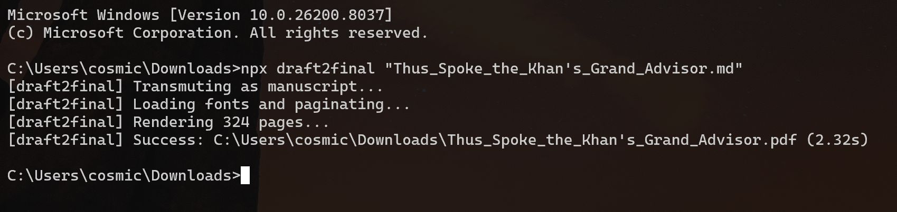
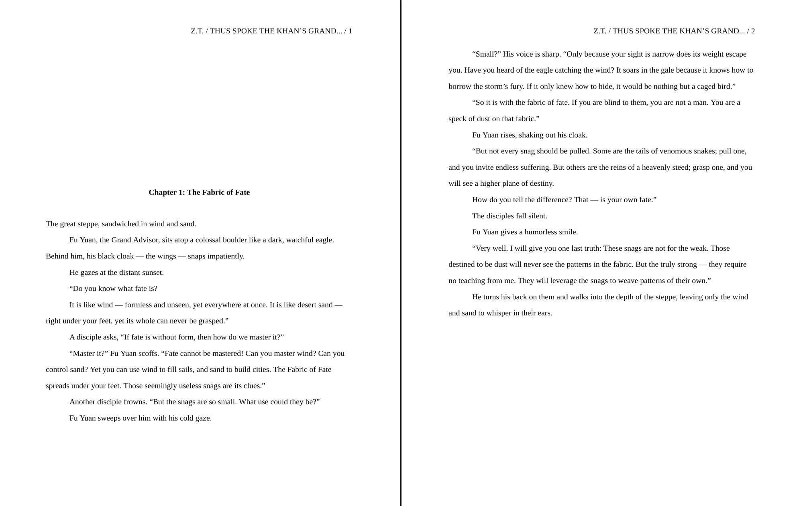
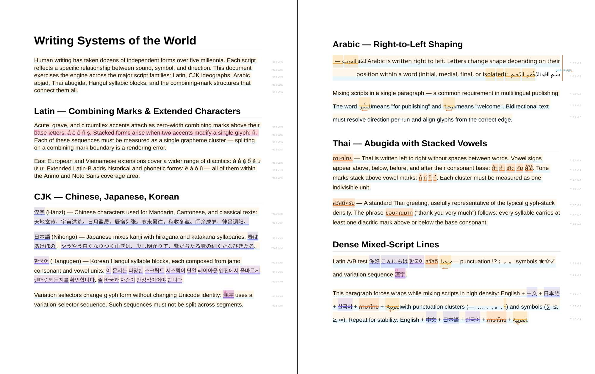

# VMPrint

> **VMPrint now ships with a browser preview demo.**  
> Render real VMPrint documents in-browser with multilingual layout, pagination, and high-fidelity canvas preview.  
> The demo is a static, self-contained page you can open directly from a local folder, and its four core runtime bundles (shared fontkit + engine + web font manager + canvas context) weigh about **0.89 MiB** total minified.  
> [Open the canvas demo](docs/examples/ast-to-canvas-webfonts/index.html) | [Browse all examples](docs/examples/index.html) | [Quickstart](QUICKSTART.md)

You've been here before.

The HTML/CSS pipeline got you 80% of the way. Then the tables started fighting the page breaks. You needed the header to say "Page 1 of 12" — but you can't know it's 12 until you've finished laying out the whole document, and by then it's too late. You tried a second pass. The second pass introduced new problems. Someone suggested spinning up a headless Chromium. It worked, mostly, except on the edge runtime, and the Lambda with the tight memory limit, and that one machine where the fonts came out wrong.

The stack stopped making sense. You kept patching.

---

VMPrint exists for that moment. Here is what it actually produces:

**325 pages. 80,000 words. Markdown to publication-standard PDF. 2.32 seconds. Surface Pro 11 tablet, running on battery. No browser. No second pass. No auxiliary files.**

Not because VMPrint is faster at doing what those tools do. Because it does something different.

---


> Every element arrived through collision — geometry negotiated in a deterministic sweep. Each block, glyph, and inline span is an actor reporting its own origin and extent.
> *All images in this README — including annotations, measurement guides, overlays, and script direction markers — are rendered entirely by VMPrint.*

---

## A Different Kind of Engine

VMPrint is a deterministic spatial simulation engine. Pages are bounded arenas. Document elements are autonomous actors with geometries. Layout is the process of reaching a stable world state.

There is no DOM underneath. No browser. No HTML. No CSS box model. The engine doesn't know what a browser is. It knows what a constraint field is. It knows what a collision is. It knows what a snapshot is, what a rollback is, and what it means for a world to settle.

This isn't a metaphor. It is the literal architecture.

A drop cap isn't a character. It's an actor with rules about how nearby text must respond. A table isn't a grid. It's a formation that holds together across boundaries, splits under constraint, and reconstructs itself on the other side. Derived regions are runtime participants too — observing, reacting, growing, and settling with the rest of the document world.

What this gives you is not just "better PDFs." It gives you a different substrate:

- a document runtime that behaves identically on a Cloudflare Worker, a laptop, a Lambda, and a phone
- a layout engine you can inspect, instrument, and participate in
- a pagination model that is not approximate — the same input produces the same output, always, everywhere
- a rendering output that is a flat, absolutely-positioned geometry list — no DOM, no layout re-traversal, just draw calls — and the right shape for GPU-accelerated rendering
- a foundation for tools the web made people forget were possible

Here is the part that makes the rest of this possible. When you hand the engine a document, each element — paragraph, table, heading, drop cap — gets compiled into a live actor. Think Lego Batman standing on the board. When Batman approaches a page boundary and doesn't fully fit, he doesn't get clipped and he doesn't get deferred. He disassembles into blocks. The blocks that fit commit to the current page. The remaining blocks reconstitute on the next page as the same Batman — same identity, same memory, same relationships — picking up exactly where he left off. A table that spans three pages is one actor that has split and reformed twice. A drop cap is an actor that claimed its territory and pushed the surrounding text to respond. None of this is post-processing. It is just what actors do when they run out of space.

The output of all that activity is refreshingly simple: a flat list of absolutely-positioned boxes with exact coordinates and the story of how each one got there. No tree. No cascade. No layout to re-run at render time — just draw calls. That flatness is what makes rendering fast, output diffable, and the path to GPU acceleration a straight line.

And then there is this: because the document is a *running simulation*, the output doesn't have to capture equilibrium. The engine can be told to capture the world at a specific tick instead — which means each page can represent a successive world state. The document becomes a valid print artifact *and* a temporal record of a running simulation. Pages that evolve. A flipbook whose frames are world states, not hand-drawn images. That has no equivalent in any prior art layout system.

---


> Actors by name, origin, size, font, and settled state. Five writing systems on one computed baseline. A naive engine drifts; this one does not.

---

## Anti-Blackbox By Architecture

Most layout systems are black boxes. Not because the source is closed, but because the architecture gives you no meaningful point of entry. You hand it input. It gives you output. What happened in between is not your concern.

VMPrint was deliberately designed to be the opposite.


> The same document rendered with `--debug`. Every actor named. Every boundary measured. Every extent, margin, and origin labeled in place.

The actor contract means you can introduce your own participants into the same simulation as native ones. The communication bus means those participants can publish and observe signals inside the same world. The overlay system means you can draw what the engine sees. The snapshot and rollback model means layout bugs become reproducible facts instead of spooky behavior. And if reactive actors ever drive the engine into a geometric oscillation loop, it doesn't silently spin — it stops deterministically and surfaces a diagnostic identifying the oscillating actor, the triggering signal, and the exact frontier where the cycle was detected. The failure mode is observable and reproducible, not a hung process.


> The same document, clean. What the reader sees. The machinery disappears. The precision does not.

The output is a flat array of absolute coordinates with semantic provenance attached:

```ts
{ sourceId: 'ast-node-10', fragmentIndex: 2, transformKind: 'split', isContinuation: true }
```

You can trace any pixel back to its source. You can diff layouts as JSON. You can replay a simulation deterministically. Transparency was designed in from the first commit.

---

## Built-In Scripting, Not Bolted-On Templating

This is where the architecture starts to feel different from anything you've used before.

Most document pipelines can't let a document respond to its own finished state. You don't know the total page count when you're authoring the footer. You don't know which headings survived layout when you're building the table of contents. You don't know what fits on page three until you've already committed to page three. So you guess, or you run two passes, or you inject values in post-processing. None of it feels clean because none of it is.

VMPrint includes a scripting layer that fires after the document has settled. The engine is the runtime. The document is a living world. Your script participates in it.

### The document knows how many pages it is

```yaml
---
methods:
  onReady(): |
    setContent("colophon", `Settled across ${doc.getPageCount()} pages.`)
---
```

`onReady` fires once — after layout has fully settled. By then, `doc.getPageCount()` returns the real answer. Not a guess. Not a pre-layout estimate. The actual settled page count, available to any element that wants it.

That is something template engines cannot do. That is something print CSS cannot do without a second pass. In VMPrint, it is two lines.

### Elements can observe the document's own structure

```yaml
---
methods:
  onReady(): |
    const chapters = elementsByType("h1")
    sendMessage("toc", {
      subject: "populate",
      payload: {
        pageCount: doc.getPageCount(),
        chapterCount: chapters.length,
        opening: chapters[0] ? chapters[0].content : "none"
      }
    })

  toc_onMessage(from, msg): |
    if (msg.subject !== "populate") return
    const p = msg.payload
    setContent(self,
      `${p.chapterCount} chapters · ${p.pageCount} pages · Opens: "${p.opening}"`)
---
```

The `toc` element starts as a placeholder. After the document settles, the document itself queries its own heading structure, packages up real settled facts, and sends them as a message. The `toc` element receives the message and rewrites itself with content that could not have existed before layout.

This is the pattern for building tables of contents, document summaries, indices, statistics blocks — anything that needs to know what the document actually contains rather than what you hoped it would contain.

### An element can replace itself — mid-document, without replay

```yaml
---
methods:
  onReady(): |
    sendMessage("statusTable", { subject: "populate" })

  statusTable_onMessage(from, msg): |
    if (msg.subject !== "populate") return
    replace([
      {
        type: "table",
        name: "statusGrid",
        table: {
          headerRows: 1,
          repeatHeader: true,
          columns: [{ mode: "flex", fr: 3 }, { mode: "flex", fr: 1 }]
        },
        children: [
          {
            type: "table-row",
            properties: { semanticRole: "header" },
            children: [
              { type: "table-cell", content: "Metric", properties: { style: { fontWeight: 700 } } },
              { type: "table-cell", content: "Value", properties: { style: { fontWeight: 700 } } }
            ]
          },
          {
            type: "table-row",
            children: [
              { type: "table-cell", content: "Total pages" },
              { type: "table-cell", content: String(doc.getPageCount()) }
            ]
          }
        ]
      },
      {
        type: "p",
        content: "Generated after layout settled."
      }
    ])
---
```

Read that carefully. The `statusTable` element starts as a plain paragraph in the authored document. When `onReady` fires, the document sends it a message. The message handler calls `replace()` — and that paragraph becomes a table and a trailing paragraph, live, in the middle of a settled document.

The document does not start over. The `statusTable` participant is removed from the live session queue. New participants — table, paragraph — are compiled from the replacement AST and spliced in at its position. Settlement resumes from the affected frontier. Everything downstream flows naturally around the new geometry.

This is not post-processing. This is not a second render pass. The document is a world of live actors. Your script is one of them.

Elements can also grow, shrink, coordinate:

```yaml
---
methods:
  greeter_onCreate(): |
    sendMessage("body", {
      subject: "decorate",
      payload: { note: "Appended by a peer after its own creation." }
    })

  body_onMessage(from, msg): |
    if (msg.subject !== "decorate") return
    prepend({ type: "p", content: "[ lead-in added by peer ]", properties: { style: { fontStyle: "italic" } } })
    append({ type: "p", content: msg.payload.note })
---
```

One element fires. Another grows — before and after — in direct response. All of it participates in the same layout physics. Nothing is patched afterward.

The scripting model is built around events, messages, and receiver-oriented mutation. Documents react to lifecycle events. Elements react to their own. Participants coordinate through direct messages. Structural change is a native runtime operation, not a workaround.

For details, see [Scripting API](documents/SCRIPTING-API.md).

---

## In Practice





> 325 pages. 80,000 words. Markdown to publication-standard PDF. 2.32 seconds. Surface Pro 11 tablet. Running on battery.
> **No browser. No second pass. No auxiliary files.**



> Full bidirectional text. Five writing systems. No HarfBuzz. No external shaping engine. Every script at its native baseline. Every line at the same distance from the next.

## Full Torture Suite — 20 Regression Fixtures, 100+ Complex Pages

| Scenario | Layout | Render | Total |
|---|---:|---:|---:|
| Warmed (shared runtime) | ~410 ms | ~29 ms | ~439 ms |

Because the pipeline is synchronous and the footprint is minimal, VMPrint can run directly in edge environments where other solutions often exceed memory or cold-start limits. It is fast enough to serve PDFs synchronously in response to user requests, without background job queues.

The engine runs identically in Cloudflare Workers, AWS Lambda, Bun, Deno, Node.js, and directly in the browser. Same input. Same fonts. Same config. Identical output — down to the sub-point position of every glyph.

---

## In the Browser

PDF covers the obvious cases. The less obvious case is worth naming.

If you need rich, publication-quality text layout in a browser — not inside a document iframe, not a blob URL workaround, actual layout running directly in JavaScript on a canvas — your choices are thin. HTML and CSS give you a layout engine, but it belongs to the browser. You can style; you cannot instrument, query, or reason about what the layout produced. Canvas gives you full control of the pixel surface but zero text layout primitives. The common workaround is to pipe through something like React-PDF, dump the result to a blob URL, and load it into a viewer. Three layers of indirection to get text on screen.

VMPrint runs natively in the browser. The `WebFontManager` fetches fonts from any URL with an in-memory cache and optional persistent caching via IndexedDB or Cache Storage. The `CanvasContext` builds each page as an SVG scene and rasterizes it onto a canvas element at any scale and DPI. The engine — same spatial simulation, same packagers, same settlement loop — runs in the browser at sub-second layout times.

```ts
import { WebFontManager } from '@vmprint/web-fonts';
import { CanvasContext } from '@vmprint/context-canvas';

const fontManager = await WebFontManager.fromCatalogUrl('/fonts/catalog.json');
const context = new CanvasContext({
  size: 'LETTER',
  margins: { top: 72, right: 72, bottom: 72, left: 72 },
  autoFirstPage: false,
  bufferPages: false
});

// ... engine.waitForFonts() + engine.simulate() + renderer.render() ...

await context.renderPageToCanvas(0, canvasElement, { scale: 1, dpi: 144 });
```

Print preview without a viewer. Live page display embedded in your product. Thumbnails. Anything requiring publication-quality layout on a canvas surface — without spinning up a browser engine to do it.

### Browser Demos

The static demos in `docs/examples/` are self-contained single-page applications — no build step, no server required. Open them directly in a browser.

**[AST JSON to Canvas](docs/examples/ast-to-canvas-webfonts/index.html)** — The full browser pipeline: `WebFontManager + Engine + CanvasContext`. Choose from built-in fixtures or upload your own JSON. Edit the AST live in the browser, hit render, navigate pages, adjust scale and DPI. The canvas demo is also a useful development tool — you can paste any document JSON and immediately see how it lays out, without running the CLI.

**[AST JSON to PDF](docs/examples/ast-to-pdf-webfonts/index.html)** — Same pipeline, output is a PDF download. `WebFontManager + Engine + PdfLiteContext`.

**[Markdown to AST](docs/examples/mkd-to-ast/index.html)** — The transmuter running standalone in the browser. Paste Markdown, get `DocumentInput` JSON. Useful for inspecting what a transmuter produces before feeding it to the engine.

To build from source:

```bash
npm run docs:build
# then open docs/examples/index.html in any browser
```

---

## draft2final

`draft2final` is a manuscript and screenplay compiler built entirely on the VMPrint API. It is also what VMPrint was originally built to produce: a tool that takes Markdown and returns publication-standard output without pain.

```bash
npx draft2final "manuscript.md"
npx draft2final "screenplay.md" --as screenplay
npx draft2final "paper.md" --as academic --style minimal
```

Supports `--as manuscript / screenplay / academic / literature` and style variants within those forms.

---

## Getting Started

Prerequisites: Node.js 18+, npm 9+

```bash
git clone https://github.com/cosmiciron/vmprint.git
cd vmprint
npm install
```

Render a JSON document to PDF:

```bash
npm run dev --prefix cli -- --input engine/tests/fixtures/regression/00-all-capabilities.json --output out.pdf
```

Source-to-PDF via `draft2final`:

```bash
npm run dev --prefix draft2final -- samples/draft2final/source/screenplay/screenplay-sample.md --as screenplay --out screenplay.pdf
```

---

## API

```ts
import fs from 'fs';
import { LayoutEngine, Renderer, toLayoutConfig, createEngineRuntime } from '@vmprint/engine';
import { PdfContext } from '@vmprint/context-pdf';
import { LocalFontManager } from '@vmprint/local-fonts';

const runtime = createEngineRuntime({ fontManager: new LocalFontManager() });
const config = toLayoutConfig(documentInput);
const engine = new LayoutEngine(config, runtime);

await engine.waitForFonts();
const pages = engine.simulate(documentInput.elements);

const context = new PdfContext({
  size: [612, 792],
  margins: { top: 0, right: 0, bottom: 0, left: 0 },
  autoFirstPage: false,
  bufferPages: false
});

const fileStream = fs.createWriteStream('output.pdf');
context.pipe({
  write(chunk) { fileStream.write(chunk); },
  end()        { fileStream.end(); },
  waitForFinish() {
    return new Promise((resolve, reject) => {
      fileStream.once('finish', resolve);
      fileStream.once('error', reject);
    });
  }
});

const renderer = new Renderer(config, false, runtime);
await renderer.render(pages, context);
```

To use only the 14 standard PDF fonts — no embedded font binaries, zero extra bytes:

```ts
import { StandardFontManager } from '@vmprint/standard-fonts';
const runtime = createEngineRuntime({ fontManager: new StandardFontManager() });
```

---

## What It Can Do

**Simulation and layout**
- DTP-style multi-column story regions with adjustable gutters
- Mixed-layout pages — full-width headers flowing into three-column articles
- `keepWithNext`, `pageBreakBefore`, orphan and widow controls
- Tables spanning pages: `colspan`, `rowspan`, row splitting, repeated header rows
- Drop caps and continuation markers when content splits across pages
- Text wrapping around complex floating obstacles across column boundaries
- Inline images and rich objects on text baselines
- Runtime-driven derived regions and scripted document composition

**Typography and multilingual**
- Grapheme-accurate line breaking via `Intl.Segmenter`
- Full bidirectional text support without external shaping engines
- CJK text breaks correctly between characters without spaces
- Indic scripts measured and broken as grapheme units, not codepoints
- Language-aware hyphenation per text segment
- Mixed-script runs sharing the same baseline across font boundaries
- Optical scaling for mixed-script inline runs
- Space-based and inter-character justification modes

**Architecture**
- Pure TypeScript, zero runtime environment dependencies
- Identical layout output across browser, Node.js, serverless, and edge runtimes
- Canvas rendering context for print preview, embedded page display, and thumbnails — no PDF viewer, no iframe
- Web font manager with URL-based loading, memory cache, and persistent caching via IndexedDB or Cache Storage
- Swappable font managers and rendering contexts via clean interfaces
- Deterministic state snapshots and rollback for speculative layout pathfinding
- Transactional inter-actor communication bus with branch-aware signal isolation
- Targeted dirty-frontier resimulation with precision restore-point targeting
- Live runtime scripting with actor-local replacement, insertion, and deletion
- JSON-serializable `Page[]` output for regression testing and pre-compilation
- Overlay hooks for instrumentation, debug grids, watermarks, and print marks

---

## Packages

| Package | Purpose |
|---|---|
| `@vmprint/contracts` | Shared interfaces |
| `@vmprint/engine` | Deterministic layout simulation core |
| `@vmprint/context-pdf` | PDF output context |
| `@vmprint/context-pdf-lite` | Lightweight jsPDF-based PDF context |
| `@vmprint/context-canvas` | Browser canvas context — page preview, thumbnails, embedded display |
| `@vmprint/local-fonts` | Filesystem font loading |
| `@vmprint/standard-fonts` | Standard font manager (no font assets) |
| `@vmprint/web-fonts` | Browser font manager — fetch from URL, persistent cache |
| `@vmprint/transmuter-mkd-mkd` | Markdown -> DocumentInput |
| `@vmprint/transmuter-mkd-academic` | Markdown -> DocumentInput (academic defaults) |
| `@vmprint/transmuter-mkd-literature` | Markdown -> DocumentInput (literature defaults) |
| `@vmprint/transmuter-mkd-manuscript` | Markdown -> DocumentInput (manuscript defaults) |
| `@vmprint/transmuter-mkd-screenplay` | Markdown -> DocumentInput (screenplay defaults) |
| `@vmprint/cli` | `vmprint` JSON -> PDF CLI |
| `@draft2final/cli` | Source -> PDF or AST CLI |

---

## Footprint

The headline number is the browser bundle with standard fonts: engine core plus the BiDi algorithm, no fontkit, no binary font assets — a fully functional layout engine that can typeset real documents across five writing systems, delivered in **~85 KiB over the wire**.

**Browser bundles (minified, Brotli-compressed):**

| Bundle | What's included | Raw | Brotli |
|---|---|---:|---:|
| Engine + BiDi, standard fonts | Engine core + bidi-js. Pairs with `@vmprint/standard-fonts` (the 14 standard PDF fonts; no embedded font binaries). Full layout, full bidirectional text, grapheme-accurate line breaking. | 398,671 B (~390 KiB) | 87,264 B (~85 KiB) |
| Engine + BiDi + fontkit | Adds fontkit for parsing any TTF/OTF file. Required for custom embedded fonts. | 764,677 B (~747 KiB) | 219,806 B (~215 KiB) |

The difference between the two is almost entirely fontkit — the OpenType parser. For environments where the 14 standard PDF fonts are sufficient, it is not needed.

**npm package sizes:**

| Package | Tarball | Unpacked |
|---|---:|---:|
| `@vmprint/engine` | 254,331 B (~248 KiB) | 1,384,942 B (~1.32 MiB) |
| `@vmprint/context-canvas` | 7,687 B (~7.5 KiB) | 29,055 B (~28.4 KiB) |
| `@vmprint/web-fonts` | 6,650 B (~6.5 KiB) | 26,420 B (~25.8 KiB) |
| `@vmprint/context-pdf-lite` | 7,209 B (~7.0 KiB) | 26,102 B (~25.5 KiB) |
| `@vmprint/standard-fonts` | 3,552 B (~3.5 KiB) | 11,125 B (~10.9 KiB) |
| `@vmprint/context-pdf` | 4,741 B (~4.6 KiB) | 16,072 B (~15.7 KiB) |
| `@vmprint/local-fonts` | 6,025,162 B (~5.75 MiB) | 12,125,265 B (~11.6 MiB) |

The `@vmprint/local-fonts` size is almost entirely the bundled font binaries. Full dependency tree including fontkit: **~2 MiB packed / ~8.7 MiB unpacked** — versus Chromium's ~170 MB.

---

## Contributing

**Engine** (`engine/`): Layout algorithms, simulation, text shaping, the packager system. This is where the hard problems live. Regression snapshot tests verify that changes haven't broken existing behavior.

**Contexts and font managers** (`contexts/`, `font-managers/`): Concrete implementations of well-defined interfaces. A new context for canvas or SVG. A font manager that loads from a CDN. The contracts are clear, the surface area is contained.

**Transmuters** (`transmuters/`): Source semantics live here. Each transmuter maps source text to `DocumentInput`. Testable and portable across browser, Node.js, and edge runtimes.

```bash
npm run test --prefix engine
npm run test:update-layout-snapshots --prefix engine
npm run build --workspace=draft2final
npm run test:packaged-integration
```

---

## Status

The core layout pipeline is working and covered by regression fixtures. PDF output is the production-ready path. Full bidirectional text support shipped without external shaping dependencies. Scripting Series 1 is now complete as a focused dynamic document-content layer with live runtime composition for its core structural operations. A provisional patent application has been filed covering the spatiotemporal simulation architecture.

The API may evolve. The fundamentals will not.

---

[Authoring Guide](documents/authoring/README.md) · [Architecture](documents/ARCHITECTURE.md) · [Engine Internals](documents/ENGINE-INTERNALS.md) · [Scripting API](documents/SCRIPTING-API.md) · [Quickstart](QUICKSTART.md) · [Contributing](CONTRIBUTING.md) · [Testing](documents/TESTING.md) · [Examples](docs/examples/index.html) · [Substack](https://substack.com/@cosmiciron)

## License

Apache 2.0. See [LICENSE](LICENSE).
