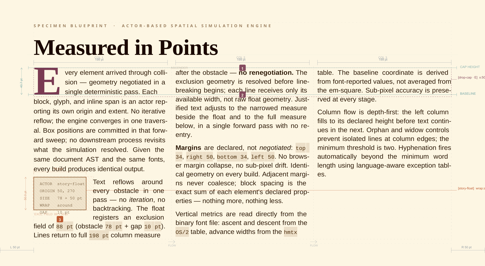
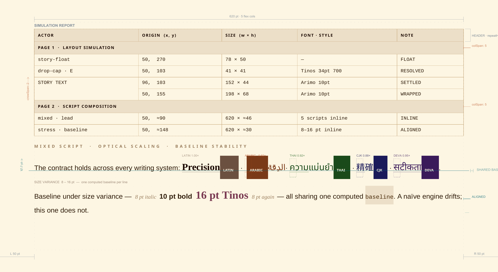

# VMPrint Engine Internals — Technical Architecture & Design Reference

This document covers the core concepts and architecture of the VMPrint engine. It is written for contributors, integrators, and anyone who wants a principled mental model of how the engine works — and why it works the way it does.

---

## The Central Insight: It's Not a Pipeline. It's a Simulation.

Every document layout engine you've used before is a pipeline. It accepts input, computes layout, emits output, and stops. The document is fully determined the moment you hand over the source. If anything needs to know about anything else — a table of contents that must report accurate page numbers, a footer that knows the total page count, a dynamic region that depends on how much space its siblings took — you run it twice, patch it in post, or accept that the numbers are approximate.

VMPrint is not a pipeline. It is a **deterministic spatial simulation engine**.

The difference is architectural. In a pipeline, the tree is traversed and the output is committed in one sweep. In a simulation, the world advances. Actors inhabit space. They negotiate geometry with their neighbors. They publish facts when their geometry commits. Other actors observe those facts, wake up, and respond — potentially adjusting their own geometry, which triggers further response. The world keeps advancing until it reaches equilibrium. *Then* the output is captured.

That framing is not a metaphor. It is the literal execution model. And it is the reason VMPrint can resolve in a single pass problems that require multiple passes — or remain permanently approximate — in every prior art system.

---

## 1. What Goes In, What Comes Out, and What Happens in Between

Understanding VMPrint starts with understanding the transformation chain. There are three distinct representations of a document as it passes through the engine, and each one has a specific job.

### The Instruction Manual: Semantic AST

What you author — or what a transmuter produces from Markdown — is a semantic tree: `DocumentInput` with nested `Element[]`. This tree is hierarchical and semantic. A table contains rows. A story contains paragraphs. A paragraph contains inline runs. The hierarchy is intentional; it reflects meaning, not geometry.

The AST is the stable source. The engine will never rewrite it to satisfy a layout problem. It is the instruction manual that stays on the shelf while the simulation runs on the board.

The newer world substrate follows the same principle. `layout.worldPlain` is authored as layout ontology, not as a public `type: "world-plain"` element. The engine may synthesize an internal host wrapper so the simulation has something concrete to run, but authored callers still describe the stage through layout and then place ordinary actors into it.

### The Board Setup: Spatial IR and Packagers

Before simulation begins, the engine normalizes the AST into a **Spatial IR** — resolving styles, computing track widths, merging inherited properties, and flattening the tree hierarchy into a sequence of simulation-ready participants. A nested paragraph becomes a `FlowBox`. A table becomes a pre-resolved `SpatialGrid` with calculated column widths. A multi-column story becomes a `NormalizedStory` that knows its zone widths.

Each spatial IR element is compiled into a **Packager** — the live actor that participates in the simulation. Packagers are the Lego characters on the board:

- `FlowBoxPackager` — handles paragraphs, headings, images, and any block that flows
- `TablePackager` / `SpatialGridPackager` — handles tables with colspan, rowspan, and page-spanning rows
- `StoryPackager` — manages multi-column flows, floats, wrap geometry, and column-spanning elements. When a spanning element carries `keepWithNext: true`, the packager performs a lookahead against the next flow child: if the child's minimum height would not fit in the remaining page space after the span, the span is overflowed to the next page rather than being stranded at the page bottom.
- `DropCapPackager` — a first-class actor that claims space and pushes neighboring text around it
- `TocPackager` — a reactive actor that observes committed heading signals and reflows its own content
- `ZonePackager` — runs independent sub-sessions for each authored zone

- `FieldActorPackager` — materializes visible actor bodies that publish generic spatial fields
- `WorldPlainPackager` — hosts actors inside the document-stage world declared by `layout.worldPlain`

Each packager implements a lifecycle contract:

- `prepare(availableWidth, availableHeight, context)` — measure and materialize content for the available space
- `emitBoxes(availableWidth, availableHeight, context)` — produce the flat positioned box output for that space
- `split(availableHeight, context)` — if the packager doesn't fit, split into `{ currentFragment, continuationFragment }`
- `getRequiredHeight()` — report the height needed after the last `prepare()`

### Self-Disassembly and Reassembly

The `split()` contract is where actors demonstrate something genuinely unusual. When a packager hits a page boundary or column boundary with insufficient remaining space, it doesn't fail — it splits.

A paragraph that spans a page break becomes two packagers: the fragment that fits on the current page, and the continuation that begins on the next. They share the same stable actor identity (`continuationOf`), meaning the communication bus, signal subscriptions, and observer relationships persist across the split. From the engine's perspective, it's the same actor in two spatial fragments.

Tables do the same thing, but more dramatically. A table that spans three pages is one actor that has split into three fragments, each fragment carrying the correct row subset, each continuation optionally repeating header rows, each fragment correctly resuming row geometry from where the previous one left off. The actor reconstitutes itself on the other side of every boundary. A complex transformation kind — `split`, `clone`, or `morph` — classifies exactly what happened so the output carries that provenance.

This self-disassembly and reassembly is the mechanism that makes tables-spanning-pages, drop caps, continuation markers, and cross-column floats work as native layout operations rather than post-processing hacks. The actors are designed to break apart and come back together. That is their purpose.

It is also the mechanism that makes live scripting work. When a script replaces an element mid-simulation, the new packager(s) are instantiated from the replacement AST and spliced into the session queue at the removed packager's position. Settlement resumes from that frontier. Everything downstream responds to the new geometry naturally — because downstream packagers have always responded to upstream geometry pressure. That is just the normal physics.

### The Output: Flat Boxes With Full Provenance

When a packager calls `emitBoxes()`, it returns a `Box[]` — a flat list of absolutely positioned primitives. Each `Box` carries:

- `x, y, w, h` — absolute page coordinates, resolved to sub-point precision
- `style` — the resolved style that governs this box's appearance
- `lines` — a `RichLine[]` for text boxes (explained below)
- `meta` — semantic provenance: `sourceId`, `fragmentIndex`, `isContinuation`, `transformKind`, `originSourceId`

The final output of a simulation is `Page[]` of `Box[]`. Completely flat. Absolutely positioned. No tree to traverse, no cascade to recompute, no layout to re-run. The renderer receives this array and issues draw calls. That's it.

This flatness is architecturally significant for two reasons. First, it makes the output serializable, diffable, and regression-testable as JSON — layout changes are visible as coordinate changes in a flat list, not as mysterious differences in rendered pixels. Second, it is the ideal input for GPU-accelerated rendering: a flat list of geometry primitives with pre-resolved styles is exactly what a GPU draw pipeline wants. The layout work is done once, deterministically. Rendering is just playback.

<p align="center">
  
</p>
<p align="center"><em>Actor boundaries, float exclusion fields, and resolved box geometry — the same data the renderer receives, made visible.</em></p>

### Inside a Box: Segments and the Multilingual Baseline

Text boxes carry a `RichLine[]` — each `RichLine` is a `TextSegment[]`. A segment is the atomic unit of text: a run of characters that shares a font, a style, a script class, a direction, and a set of measured metrics (`width`, `ascent`, `descent`, pre-shaped glyphs for complex scripts).

A single line of text may contain many segments. A line that mixes English, Arabic, and Devanagari is not three separate boxes — it is one `RichLine` with segments from three script classes, each measured against its own font metrics, each carrying its own direction flag for BiDi reordering.

The baseline calculation operates over all segments on the line simultaneously. It finds the dominant metrics — the largest ascent, the reference scale — and positions every segment against the same baseline. A Devanagari segment with a different optical size sits at the same baseline as the surrounding Latin text, scaled and aligned correctly, without an external shaping engine and without approximation.

This is how VMPrint renders five writing systems on one line without HarfBuzz. The segments carry everything the renderer needs. The baseline math is local and deterministic. Each glyph knows its own position. The output is exact.

<p align="center">
  
</p>
<p align="center"><em>Top: simulation report — actors with resolved world-space origins and sizes. Bottom: Latin, Arabic, Thai, CJK, and Devanagari sharing one computed baseline.</em></p>

---

## 2. The World Is Primary. Pages Are Viewports.

In every prior art layout system, the page is the primary unit. Content is assigned to pages. Page breaks are the organizing fact.

VMPrint inverts this.

The document world is a **persistent coordinate system** with a stable origin, a known width, and an **exploration frontier** — the leading edge of everything the simulation has visited so far. As simulation advances, the frontier moves forward. Space behind the frontier is settled. Space ahead is not yet known. It is, in the language of the architecture, *fog-of-war*: world territory that exists conceptually but hasn't been explored yet.

A **page** is a **viewport projection** over a slice of world space. When the simulation fills a viewport, it advances to the next one. The page boundaries are a consequence of the viewport plan over world space — they are not containers that content is assigned to. They are windows that reveal portions of a continuous world as the simulation advances.

This has practical consequences that matter:

- **Zones are world regions, not page regions.** A multi-column story zone is defined against world coordinates. It extends across as many viewports as it takes to exhaust its content. The engine doesn't need linked frame workarounds — the zone is just a region in the world, and viewports reveal successive slices of it.
- **Non-contiguous flows resolve naturally.** If content should continue in a non-adjacent region, that's a viewport planning question, not a special-case linked-frame mechanism.
- **The page count is a derived fact, not a declaration.** You don't pre-declare ten pages and fill them. The simulation runs until the world is settled, and however many viewports it took is how many pages you have.

- **Sequential document flow is one inhabitant of the world, not the world itself.** Stories and plain flow are rivers moving through the substrate. World-space actors such as `field-actor`s can exist alongside them and publish spatial fields that the settling actors must negotiate around.

The exploration frontier gives the engine a meaningful model for "how much of the world has been seen." It is the boundary between committed space and not-yet-simulated space. Dirty-frontier resimulation — explained below — targets that frontier with precision.

---

## 4. Four Layers. One Protected Boundary.

The architecture enforces strict separation across four layers:

**Layer 1 — The Simulation Kernel (The Substrate)**

The kernel is the foundation of the engine, and it is deliberately ignorant of document concepts. It does not know what a paragraph is, what a page counter is, or what a table of contents is. It knows:

- mutable world state
- actor identity and activation state
- event dispatch and actor wake scheduling
- update outcome classification and routing
- deterministic snapshot and rollback

The kernel boundary is protected. No document-semantic concern may enter this layer. The kernel treats every actor as an opaque participant in the world. This separation is what makes the engine extensible without becoming unprincipled.

**Layer 2 — Engine Systems (The Runtime)**

The lateral execution plane above the kernel. It governs:

- physical constraint resolution within world space
- actor transitions across viewport boundaries
- phase-hook collaborator dispatching
- the session-owned inter-actor communication bus
- observer registry, checkpoint registry, dirty-frontier tracking
- viewport planning, topic-based actor wakeup scheduling
- oscillation detection

**Layer 3 — Document Semantics (The Translation Layer)**

Maps user-authored AST into simulation-ready actors: paragraphs, tables, stories, headings, images — each compiled into a physical actor with an explicit world-space geometry, behavioral contract, and optional signal subscriptions.

**Layer 4 — Print/Composition Handoff (The Output Layer)**

Converts final committed world-space coordinates into viewport-projected page arrays, and those into renderable artifacts: PDF, canvas, SVG.

The reason this layering matters: when you diff a layout as JSON, trace a pixel to its source, or watch an actor's debug overlay, those capabilities come from the clean separation between layers. There is no entanglement to peel apart.

---

## 5. Actors: Lifecycle and Participation

Document elements are instantiated as **Transformable Actors** with stable runtime identities. An actor is not just a positioned box — it is a participant in the world with kernel-tracked **activation state**.

Every actor exists in one of four states:

- **Dormant** — not participating, consuming negligible resources. *This is the default.* Most actors in most documents are dormant most of the time.
- **Event-Awakened** — a committed signal matching the actor's declared topic subscriptions was published. The runtime has scheduled this actor for evaluation.
- **Active** — explicitly scheduled by engine logic or authored scripting.
- **Suspended** — participation explicitly paused.

The governing principle is: **publish narrowly, wake narrowly, settle narrowly.**

Committed signals are topic-based. When a signal is published, the runtime identifies only the actors subscribed to that signal's topic and marks them event-awakened. Every other actor remains dormant. The awakened-actor queue is drained in deterministic order.

This means the cost of a committed signal is proportional to the number of subscribed actors — not to the total actor count in the document. A 500-page document with one TOC observer and four heading publishers has the same signal cost as a 5-page document with the same topology.

### The Actor Update Interface: From Pipeline to Simulation

The architectural boundary between a pipeline and a simulation is a single optional interface: `update()`.

In a pipeline, an actor is placed and forgotten. Its geometry is computed once. It does not participate in what happens afterward.

An actor that implements `update()` can do something different. When awakened by a matching committed signal, the runtime invokes `update()` within the ongoing simulation. The actor inspects committed world state and returns a classified outcome. It does not need to be re-run from scratch. The world does not need to restart. The actor simply observes, decides, and acts — and the engine routes the consequence at minimum necessary cost.

This is how a TOC actor knows accurate page numbers in a single pass. It observes committed heading signals, accumulates them, and when asked for its geometry, reports the right answer — because it has been watching the world settle in real time.

The `update()` interface is dormant-by-default and opt-in. The engine does not impose a temporal tick on every actor. It offers temporal participation to the actors that need it, leaving all others undisturbed.

A critical correctness requirement follows: an actor's accumulated update state must be correctly captured in deterministic snapshots and faithfully restored on rollback. Without this, `update()` would break the deterministic settlement guarantees the rest of the architecture depends on.

---

## 6. Three-Tier Update Outcome Classification

When an awakened actor's `update()` is invoked, it returns one of three classified outcomes. Each carries a distinct cost model and a distinct engine response.

**Tier 1 — None**
The actor inspected committed state and determined that nothing needs to change. The engine takes no action. Cost: negligible.

**Tier 2 — Content-Only**
The actor's rendered content changed — a counter updated its number, a label changed its text, a reactive observer updated its displayed entries — but its required spatial geometry is unchanged. The engine redraws the actor's owned boxes in place at their current world-space positions. No dirty frontier is recorded. No checkpoint is restored. Upstream and downstream actors are not replayed. Cost: low, proportional to the actor's own rendering work.

This tier is the one that prior art systems don't have. In every existing layout engine, any content change routes through the same undifferentiated recalculation response. Content-only updates are structurally invisible — they get the same treatment as geometry-changing ones regardless of their actual impact. VMPrint makes this a first-class primitive. A page counter updating from 11 to 12 does not trigger a resettlement sweep. It redraws in place and stops.

**Tier 3 — Geometry**
The actor's required spatial extent changed. Something grew, shrank, or shifted in a way that affects the positions of other actors downstream. The engine records the earliest affected frontier and routes the result through targeted dirty-frontier resimulation. Cost: proportional to the size of the invalidated spatial region, bounded by precision restore-point targeting.

---

## 7. Branch-Aware Transactional Communication

The session owns an **inter-actor communication bus** that implements database-style transaction isolation for layout signals.

Signals generated during a speculative layout branch are isolated in **provisional staging buffers** tagged with the active branch ID. If the branch is committed, those signals are promoted to the committed stream. If the branch is rolled back, the staged signals are discarded. Committed observers never see staged signals from a branch that didn't happen.

This is how native single-pass artifact collection works. A TOC actor is a committed observer. Heading actors publish outline-entry signals when their geometry commits. The TOC accumulates those signals from the committed stream, constructs its entries, and when its own geometry is evaluated, it has accurate data — because it has been observing only the signals from geometry that actually committed.

No auxiliary files. No second pass. No `.aux` file, no external BibTeX process, no multi-pass LaTeX compilation. The bus handles it.

The bus also supports **multi-hop reactive signal chains**: an aggregator actor can consume signals from multiple publishers, publish a normalized summary signal of its own, and a downstream follower actor can alter its spatial geometry in response to that summary — all within the single simulation pass. Prior art systems have no mechanism for this.

---

## 8. Speculative Layout Pathfinding

Typographic continuity rules — widow/orphan control, keep-with-next, cohesion policies — require the engine to evaluate hypothetical placements before committing.

The **Cohesion Orchestrator** is the rule-evaluation module that handles this. Its method:

1. Detect cohesion policy on an incoming actor sequence.
2. Instruct the kernel to capture a **deterministic state snapshot**.
3. Execute a speculative placement branch with signals isolated in a provisional buffer.
4. Score the resulting geometry against the continuity policy.
5. If satisfied: commit the branch. If not: execute a **deterministic rollback** restoring world state to the bit-for-bit identical snapshot, then dictate an alternative placement.

The snapshot and rollback are kernel primitives. They include actor activation state, accumulated `update()` state, all world-space coordinates, and the signal bus staging buffers. Rollback is genuinely atomic — re-executing the simulation from any snapshot produces identical outcomes.

This is the architecture that makes speculative pathfinding possible without re-running the document. The engine can try a placement, observe the result, and undo it — precisely and cheaply.

---

## 9. Targeted Dirty-Frontier Resimulation

When an observer reports a geometry change — its content grew, a TOC entry was added and it needs more space — the engine must replay layout from the point of impact. But it does not replay the whole document.

The mechanism:

1. After each actor completes placement, the session records an **anchored checkpoint** at that actor's committed trailing edge in world space.
2. On each checkpoint sweep, all registered observers are reevaluated. Observers reporting geometry changes produce **dirty frontier records**.
3. The engine finds the **nearest anchored checkpoint preceding the earliest dirty frontier**.
4. World state is restored to that checkpoint — **excluding all upstream actors from replay**. Actors above the checkpoint are not touched.
5. The session replays forward with only actors at and downstream of the dirty frontier re-entering the world.
6. Forward march does not resume until all registered observers reach settled state.

**Precision restore-point targeting** is the mechanism that ensures upstream actors are truly excluded. If a heading on page 1 is locked and a TOC on page 3 needs to grow, the restore point is selected to exclude the page-1 heading entirely. It was rendered exactly once, at Render Count: 1, and it stays there. Only the downstream region replays.

**Concurrent independent observer settlement** allows multiple observers to settle independently within the same bounded replay cycle. They don't queue behind each other — they run in parallel under the same bounded sweep.

**Sub-page intra-slice settling** means the checkpoint sweep fires at actor-advancement boundaries, not only at viewport boundaries. Settlement can be triggered and resolved entirely within a single page if the publisher and observer are co-located there.

---

## 10. Deterministic Oscillation Detection and Hard Stop

The most significant technical hazard in any reactive spatial engine is oscillation: an actor receives a signal, reports a geometry change, resettlement triggers a new signal, the same actor wakes again, geometry changes again, and the system enters a cycle.

Prior art systems have no principled mechanism to detect or bound this. They degrade into silent infinite recalculation.

VMPrint treats oscillation as a first-class problem with three safeguards:

1. **Bounded settlement cycles.** The runtime enforces a hard cap on geometry-triggered resettlement cycles. If the cap is reached, the engine stops.
2. **Repeated-state detection.** If the same actor, update frontier, and state signature repeat across settlement cycles, the pattern is identified as oscillation.
3. **Deterministic hard stop with diagnostic output.** The engine stops and surfaces a structured diagnostic identifying: the oscillating actor; the committed signal topic and sequence count that triggered the cycle; the checkpoint identifier and frontier position at which the cap was reached; and the full sequence of update outcomes that produced the loop.

The failure mode is deterministic, observable, and reproducible. The rendered output itself can carry the diagnostic — the oscillation trail is visible on the page, not only in a log.

---

## 11. Print-as-World-Slice Capture

The most architecturally novel aspect of the engine is a model that prior art systems don't have at all: **print-as-world-slice**.

In all prior art layout systems, document production is a pipeline: the engine runs until layout is complete, then output is emitted, and the engine stops. There is no concept of ongoing simulation time.

VMPrint adds a **kernel-owned simulation clock**: a discrete, deterministic, subsystem-agnostic tick counter that advances independently of pagination, rendering, observer sweeps, and document capture.

**Stopping policy** — the condition under which the running simulation is captured into paged output — is a separate concern from the clock. The kernel owns the clock. Policy decides when to pause and capture. Policies include:

- **Settle-immediately** — the world is captured when it reaches spatial equilibrium. This is the normal document layout behavior. Under this policy the engine produces output identical to prior art, but it is now understood as a world simulation that happened to reach equilibrium quickly.
- **Fixed-tick-count** — the world is simulated for exactly N kernel ticks before capture. Each tick advances actor state, invokes `update()` for awakened actors, classifies and routes outcomes.
- **Signal-triggered capture** — capture occurs when a specific committed world fact is published to the event bus.
- **Stability-condition capture** — capture occurs when a user-defined predicate over committed world state evaluates true.

Under the fixed-tick-count policy, each page of the output document represents the world state at a specific simulation tick. The document is simultaneously a valid static print artifact and a **temporal record of world simulation history** — a flipbook whose frames are successive world states, not hand-drawn images.

This model enables categories of document behavior that have no prior art equivalent: documents whose pages evolve across simulation time; generative AI interfaces where each page reveals the next stage of an unfolding model output; animated reference documents where state transitions are made visible in print.

---

## 10. Output: Flat, Traceable, Testable

The final output of the engine is a flat array of `Page` objects containing positioned boxes with absolute world-space coordinates and **semantic provenance**:

```ts
{ sourceId: 'ast-node-10', fragmentIndex: 2, transformKind: 'split', isContinuation: true }
```

Every box knows which AST node produced it, what transformation kind placed it there, and whether it is a continuation of a split actor. Every pixel is traceable to its origin. Layouts can be diffed as JSON. Simulations can be replayed deterministically. The output is fully serializable for regression testing and pre-compilation.

---

## What This Architecture Makes Possible

The architecture described above is not theoretical. It is the reason the reference implementation converts a 325-page manuscript in 2.32 seconds on battery without a browser, a second pass, or auxiliary files. It is the reason a TOC actor can report accurate page numbers in a single pass. It is the reason content-only updates — the common case — never trigger unnecessary spatial resettlement. It is the reason layout bugs are reproducible facts with deterministic diagnostics instead of spooky behavior.

It is also the reason VMPrint can do things that no prior art layout system can do: resolve mutually dependent spatial regions in a single pass, chain multi-hop reactive signals within that pass, and capture a document's output as a world-state snapshot at a configurable simulation horizon rather than the inevitable result of a one-shot pipeline run.

The engine is not a better version of what came before. It is a different category of thing.
